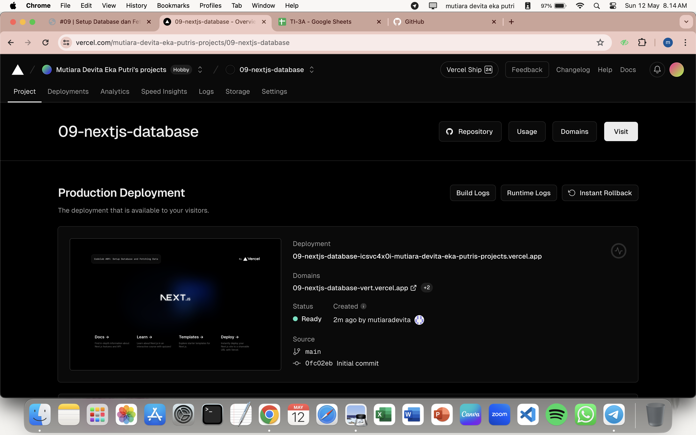
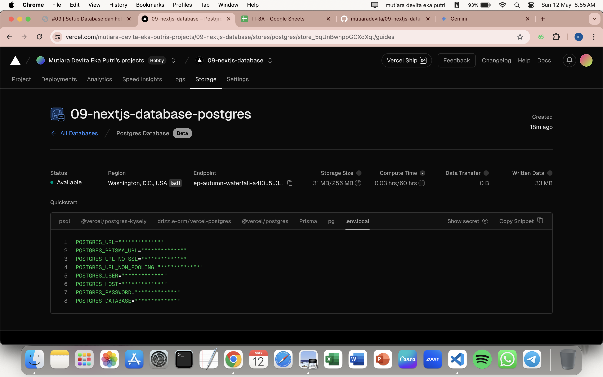
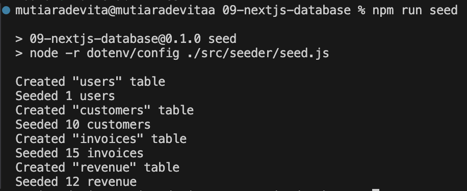
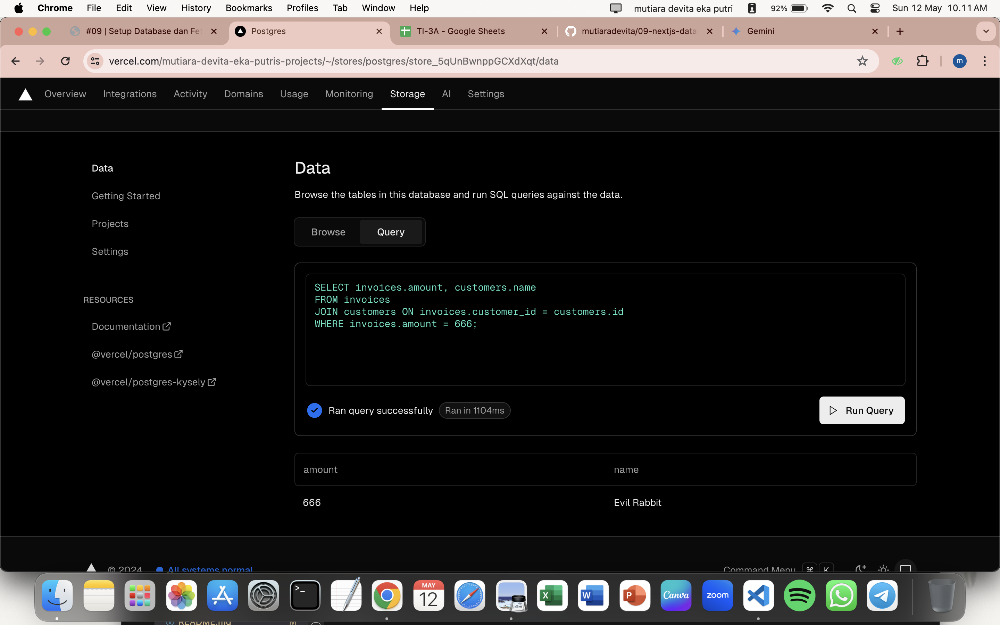
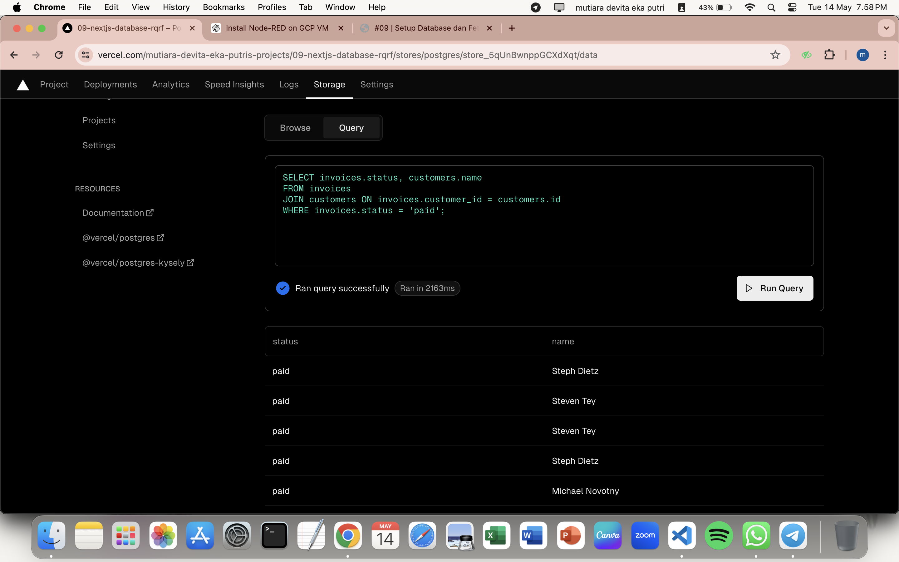
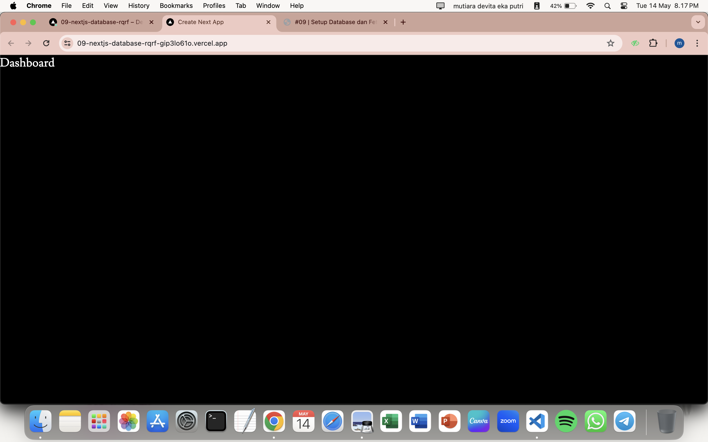
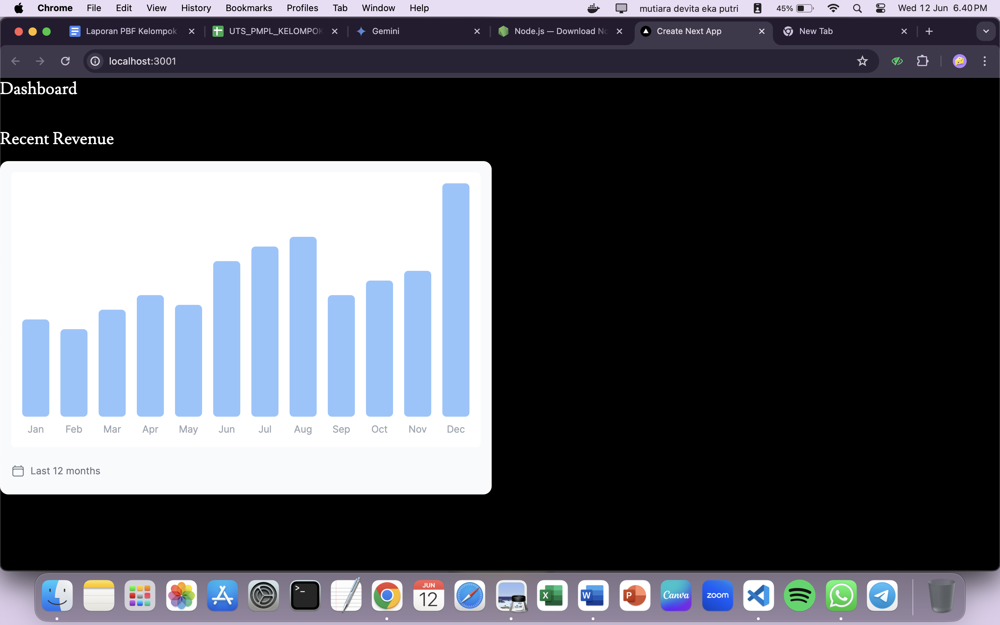
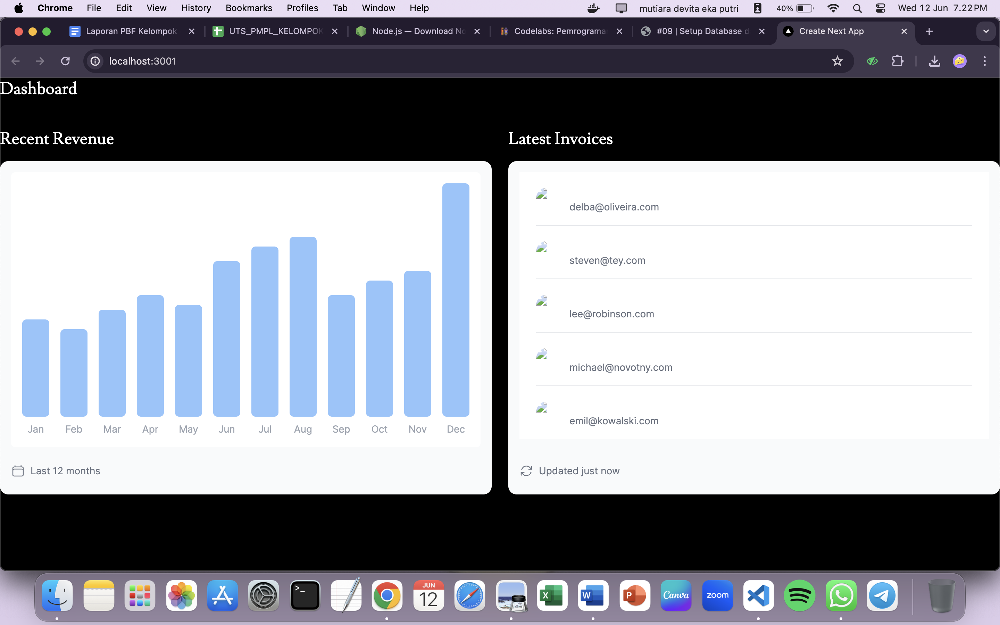

|  | Pemrograman Berbasis Framework 2024 |
|--|--|
| NIM |  2141720135 |
| Nama |  Mutiara Devita Eka Putri |
| Kelas | TI - 3A |

1. Capture hasil deploy project Anda dan buatlah laporan di file README.md. Jelaskan apa yang telah Anda pelajari?
Jawab :

Pada langkah ini kita mempelajari cara mendeploy project kita pada vercel untuk membangun, menskalakan, dan mengamankan web yang lebih cepat dan lebih personal.

2. Capture hasil basis data Anda dan buatlah laporan di file README.md. Jelaskan apa yang telah Anda pelajari?
Jawab :

Pada langkah ini kita mempelajari cara membuat basis data Postgres pada vercel dan menginstal vercel Postgres SDK.

3. Capture hasil npm run seed Anda dan buatlah laporan di file README.md. Jelaskan apa yang telah Anda pelajari ?
Jawab :

Pada langkah ini kita mempelajari cara melakukan seed ke basis data dimana kita mengisi beberapa data awal seperti tabel invoices, customers, user, dan revenue.

4. Capture hasil query Anda dan buatlah laporan di file README.md. Jelaskan apa yang telah Anda pelajari ? 

Cobalah eksekusi query SQL yang lain sesuai kreasi Anda, capture hasilnya dan jelaskan!

Query SQL yang saya gunakan yaitu untuk menampilkan tabel nama yang mempunyai status pembayaran paid.

5. Lakukan push, kemudian perhatikan di akun dashboard Vercel project Anda. Capture dan lampirkan link aplikasi Anda yang telah berhasil di deploy, kemudian buatlah laporan di file README.md. Jelaskan apa yang telah Anda pelajari ?
Jawab : 
link aplikasi : 09-nextjs-database-rqrf.vercel.app

6. Lakukan capture dan push hasilnya, kemudian buatlah laporan di file README.md. Jelaskan apa yang telah Anda pelajari ?
Jawab :

Pada langkah ini kita melakukan uncomment pada kode yang sebelumnya udah kita buat yaitu RevenueChart untuk menampilkan chart pada project Vercel yang kita buat. Untuk memperbaiki tampilan grafik yang kurang baik kita harus menghapus bagian sm: pada components - molecules - revenue-chart.tsx pada line 31.

7. Lakukan capture dan push hasilnya, kemudian buatlah laporan di file README.md. Jelaskan apa yang telah Anda pelajari ?
Jawab : 

Pada langkah ini kita menggunakan kueri SQL untuk mengambil beberapa data daripada harus memilah satu persatu data dengan jumlah data yang banyak, ketika data yang ditransfer secara signifikan pada setiap permintaan.

