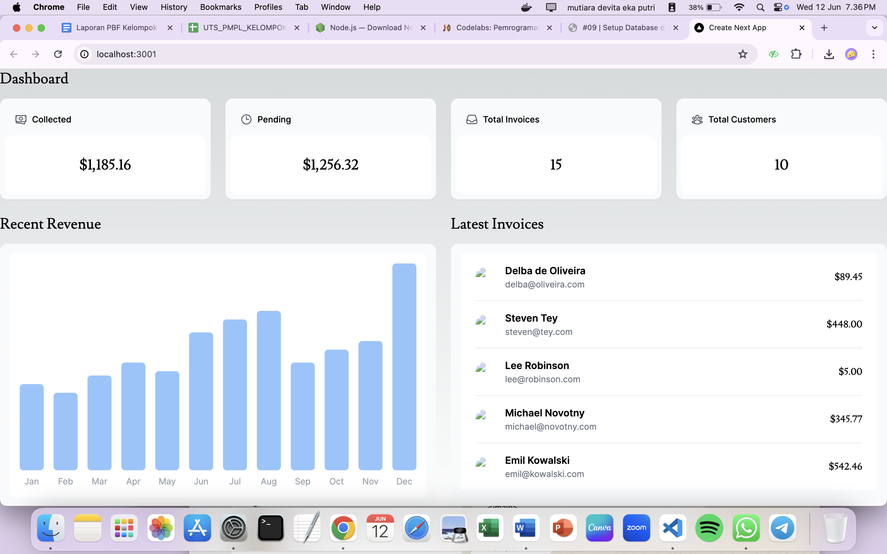
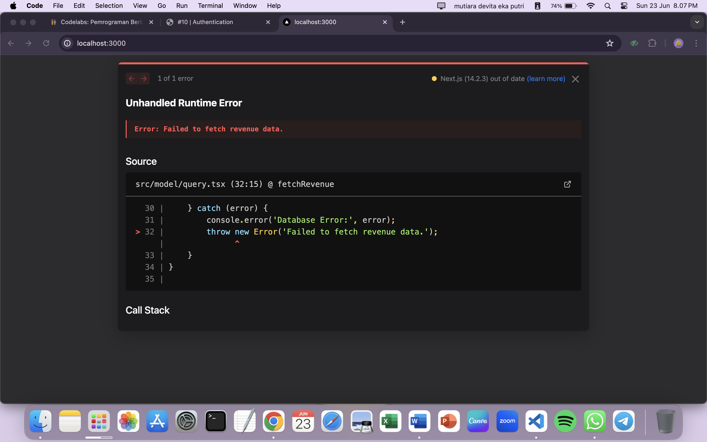

|  | Pemrograman Berbasis Framework 2024 |
|--|--|
| NIM |  2141720135 |
| Nama |  Mutiara Devita Eka Putri |
| Kelas | TI - 3A |

# WEEK 9
1. Capture hasil deploy project Anda dan buatlah laporan di file README.md. Jelaskan apa yang telah Anda pelajari?

Jawab :

Pada langkah ini kita mempelajari cara mendeploy project kita pada vercel untuk membangun, menskalakan, dan mengamankan web yang lebih cepat dan lebih personal.

2. Capture hasil basis data Anda dan buatlah laporan di file README.md. Jelaskan apa yang telah Anda pelajari?

Jawab :

Pada langkah ini kita mempelajari cara membuat basis data Postgres pada vercel dan menginstal vercel Postgres SDK.

3. Capture hasil npm run seed Anda dan buatlah laporan di file README.md. Jelaskan apa yang telah Anda pelajari ?

Jawab :

Pada langkah ini kita mempelajari cara melakukan seed ke basis data dimana kita mengisi beberapa data awal seperti tabel invoices, customers, user, dan revenue.

4. Capture hasil query Anda dan buatlah laporan di file README.md. Jelaskan apa yang telah Anda pelajari ? 

Jawab :

Cobalah eksekusi query SQL yang lain sesuai kreasi Anda, capture hasilnya dan jelaskan!

Query SQL yang saya gunakan yaitu untuk menampilkan tabel nama yang mempunyai status pembayaran paid.

5. Lakukan push, kemudian perhatikan di akun dashboard Vercel project Anda. Capture dan lampirkan link aplikasi Anda yang telah berhasil di deploy, kemudian buatlah laporan di file README.md. Jelaskan apa yang telah Anda pelajari ?

Jawab : 
link aplikasi : 09-nextjs-database-rqrf.vercel.app

6. Lakukan capture dan push hasilnya, kemudian buatlah laporan di file README.md. Jelaskan apa yang telah Anda pelajari ?

Jawab :

Pada langkah ini kita melakukan uncomment pada kode yang sebelumnya udah kita buat yaitu RevenueChart untuk menampilkan chart pada project Vercel yang kita buat. Untuk memperbaiki tampilan grafik yang kurang baik kita harus menghapus bagian sm: pada components - molecules - revenue-chart.tsx pada line 31.

7. Lakukan capture dan push hasilnya, kemudian buatlah laporan di file README.md. Jelaskan apa yang telah Anda pelajari ?

Jawab : 

Pada langkah ini kita menggunakan kueri SQL untuk mengambil beberapa data daripada harus memilah satu persatu data dengan jumlah data yang banyak, ketika data yang ditransfer secara signifikan pada setiap permintaan.

8. Jika Anda perhatikan pada file src\app\page.tsx untuk komponen Card sebenarnya telah dibuat sebagai molecules pada file src\app\components\molecules\card.tsx yaitu komponen CardWrapper. 

Jawab :

Pada Langkah ini kita melakukan import CardWrapper pada page.tsx untuk mengambil data Cardwapper pada card.tsx.

9. Perhatikan fungsi fetchCardData() (pada file src\model\query.tsx) dari soal nomor 1. Jelaskan maksud kode dan kueri yang dilakukan dalam fungsi tersebut!

Jawab :
- export async function fetchCardData() { ... }: Baris ini mendeklarasikan fungsi asynchronous (yang artinya bisa menunggu operasi lain selesai) bernama fetchCardData. Fungsi ini nantinya bisa dipanggil dari tempat lain di program.
- noStore();: Baris ini kemungkinan memanggil fungsi lain bernama noStore yang fungsinya (berdasarkan namanya) mencegah data yang diambil oleh fungsi ini untuk disimpan di cache.
- try { ... } catch (error) { ... }: Blok kode ini digunakan untuk menangani kemungkinan adanya error (kesalahan) saat mengambil data.
- Bagian try { ... }: Di dalam blok ini, program mencoba menjalankan kode untuk mengambil data.
- const invoiceCountPromise = sql...: Baris ini menjalankan query SQL pertama yang fungsinya menghitung jumlah record (baris) pada tabel invoices. Hasil query disimpan dalam variabel invoiceCountPromise.
- Baris selanjutnya serupa dengan baris sebelumnya, menjalankan query untuk menghitung jumlah record pada tabel customers dan menghitung total invoice yang berstatus "paid" dan "pending". Hasil query disimpan dalam variabel customerCountPromise dan invoiceStatusPromise.
- const data = await Promise.all([...]);: Baris ini menggunakan fungsi Promise.all untuk menunggu semua query SQL yang dijalankan sebelumnya selesai. Hasil dari ketiga query disimpan dalam array data.
- const numberOfInvoices = ...: Mengambil nilai jumlah invoice dari hasil query pertama dan mengubahnya menjadi angka.
- Baris selanjutnya serupa, memproses hasil query lainnya untuk mendapatkan jumlah customer, total invoice paid, dan total invoice pending.
- Fungsi formatCurrency kemungkinan digunakan untuk memformat angka menjadi bentuk mata uang (misalnya rupiah).
- return { ... }: Baris ini mengembalikan sebuah objek yang berisi data ringkasan yang diambil, yaitu jumlah customer, jumlah invoice, total invoice paid, dan total invoice pending.
- Bagian catch (error) { ... }: Blok ini akan dieksekusi jika terjadi error saat mengambil data.
- console.error(...): Baris ini mencetak pesan error ke console developer untuk debugging.
- throw new Error(...): Baris ini melempar error baru dengan pesan "Failed to fetch card data." sehingga bisa ditangkap dan ditangani oleh bagian program lainnya.
- const ITEMS_PER_PAGE = 6;: Baris ini mendeklarasikan konstanta ITEMS_PER_PAGE dengan nilai 6. Kemungkinan ini digunakan untuk mengatur jumlah invoice yang ditampilkan per halaman pada bagian lain program.

Kesimpulan:
Fungsi fetchCardData ini mengambil data ringkasan yang dibutuhkan untuk menampilkan informasi pada invoice dashboard, seperti jumlah customer, jumlah invoice, dan total invoice berdasarkan status pembayaran.

# WEEK 10
1. Coba running di localhost, capture hasilnya dan buatlah laporan di README.md. Jelaskan apa yang telah Anda pelajari dan bagaimana tampilannya saat ini? Apakah ada error ?

Jawab :

2. Capture hasil form login yang telah dibuat dan buatlah laporan di README.md.

 Jawab : 
 Terdapat error sehingga harus lanjut terlebih dahulu ke praktikum 3.